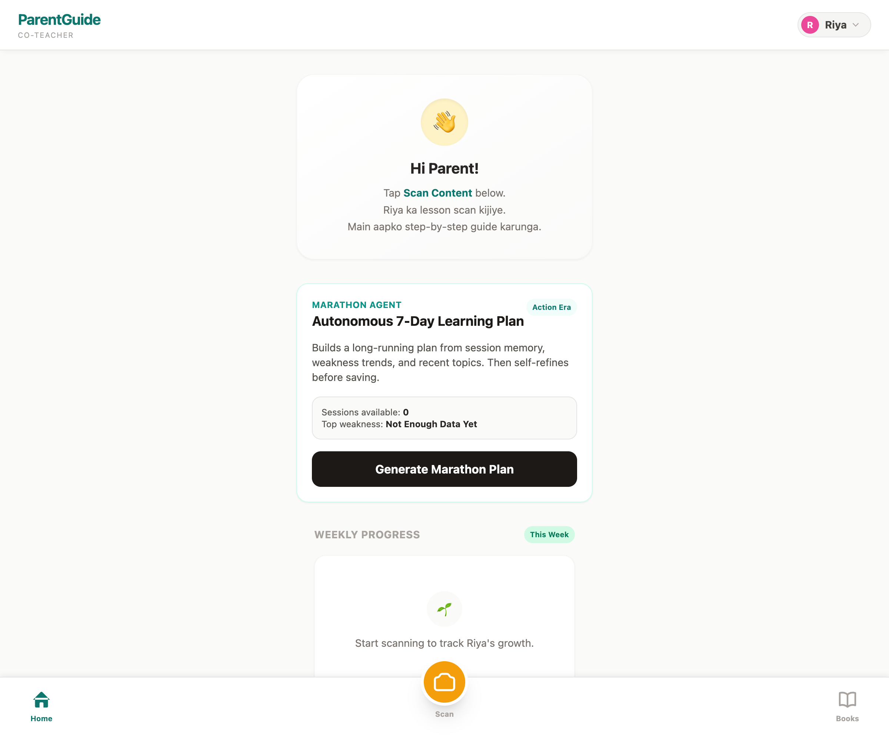
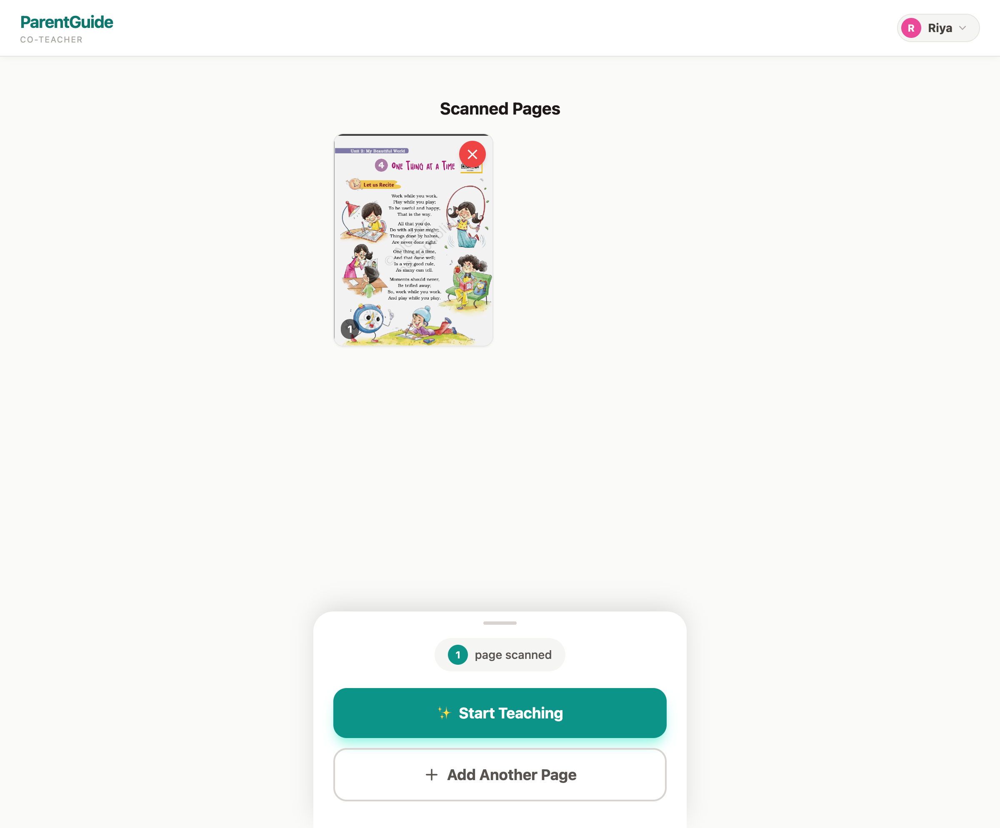
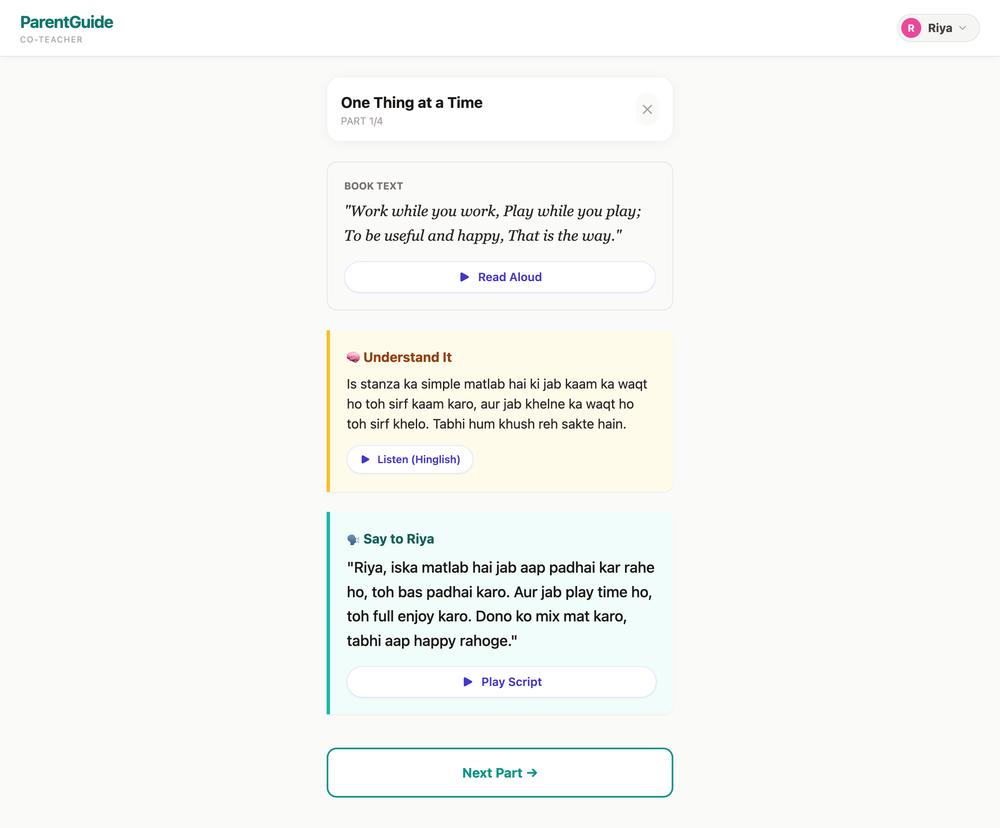
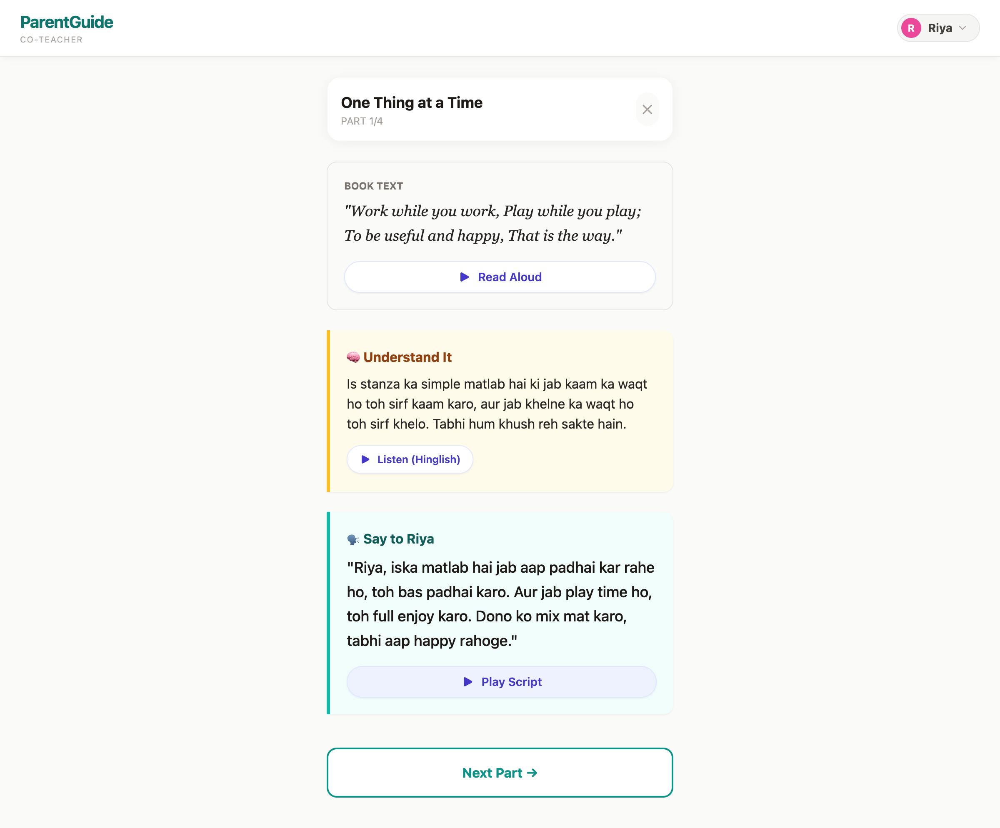
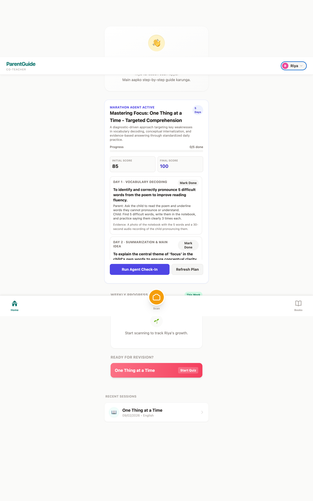
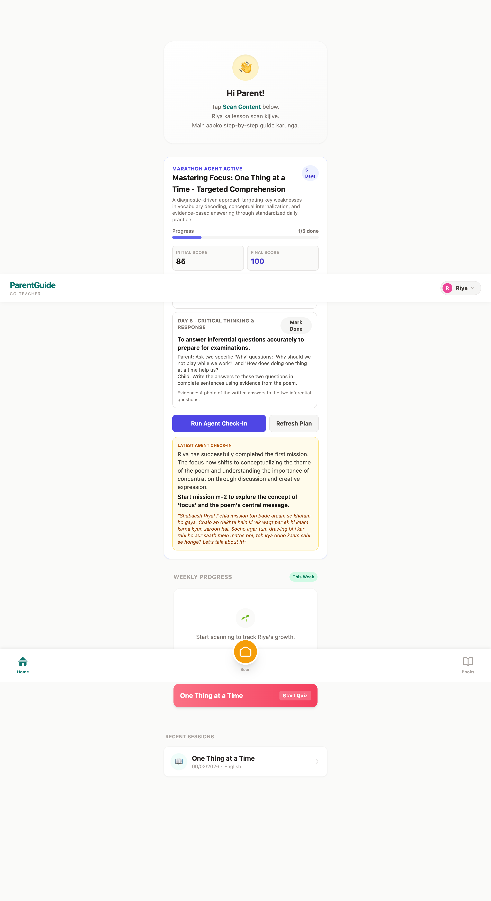

# Parent-Co-Teacher Demo Walkthrough

**Gemini 3 API Hackathon Submission**

This document captures the complete demo flow with screenshots and explanations for each step.

---

## Overview

Parent-Co-Teacher is an AI-powered learning orchestration system that helps parents with limited English literacy teach their children effectively using Hinglish (natural Hindi-English code-mixing) and audio guidance.

**Key Gemini Integrations:**
- Gemini 3 Pro (Vision) - Homework image analysis
- Gemini 3 Pro (Reasoning) - Marathon Agent with self-critique
- Gemini 3 Flash - Bilingual content generation
- Gemini TTS - Audio synthesis for accessibility

---

## Step 1: Home Screen (Fresh State)



**What you see:**
- Clean dashboard with "Hi Parent!" greeting in bilingual text
- Kid profile selector (Riya - Class 4, English)
- Marathon Agent panel showing "Sessions available: 0"
- Scan button prominently displayed at bottom

**Key talking point:** "The app greets parents in both English and Hinglish from the start, making them feel comfortable."

---

## Step 2: Scan Homework



**What you see:**
- Uploaded homework image preview (English poem: "One Thing at a Time")
- Page counter showing "1 page scanned"
- "Start Teaching" button to begin analysis
- Option to add more pages

**Key talking point:** "Parents simply photograph their child's homework. No typing required."

---

## Step 3: Chapter Guide Generated



**What you see:**
- **Book Text** (cream card): Original poem extracted by Gemini Vision
- **Understand It** (yellow card): Hinglish explanation for the parent
  - "Is stanza ka simple matlab hai ki jab kaam ka waqt ho toh sirf kaam karo..."
- **Say to Riya** (teal card): Exact script parent speaks to child
  - "Riya, iska matlab hai jab aap padhai kar rahe ho, toh bas padhai karo..."
- Audio buttons for each section

**Key talking point:** "This isn't translation - it's natural Hinglish, the way Indians actually speak. The parent knows exactly what to say."

---

## Step 4: Audio Playback



**What happens:**
- Clicking "Play Script" generates TTS audio via Gemini
- Parent hears the Hinglish script spoken naturally
- Button changes to "Stop" during playback
- Visual feedback confirms audio is playing

**Key talking point:** "Even if the parent struggles to read, they can LISTEN to the script and repeat it to their child. This is accessibility in action."

---

## Step 5: Home After Session


**What you see:**
- "Sessions available: 1" - Session was tracked
- "Ready for Revision?" section appeared with quiz option
- "Recent Sessions" shows saved session
- All data persisted in IndexedDB

**Key talking point:** "The app remembers every session. This isn't a stateless chatbot - it's building a learning history."

---

## Step 6: Marathon Agent Generated



**What you see:**
- **"Marathon Agent Active"** header with 5 Days badge
- **Quality Scores: Initial 85 → Final 100** (self-improvement!)
- **5-Day Learning Plan** with structured missions:
  - Day 1: Vocabulary Decoding
  - Day 2: Summarization & Main Idea
  - Day 3: Visual Processing
  - Day 4: Textual Analysis
  - Day 5: Critical Thinking & Response
- Each mission has:
  - Parent action
  - Child task
  - Evidence requirement (photo proof)

**Key talking point:** "Notice the quality score improvement - the agent critiqued its own plan and improved it from 85 to 100. This is autonomous reasoning, not a simple prompt."

---

## Step 7: Adaptive Check-In



**What you see:**
- Progress updated to "1/5 done" after marking Day 1 complete
- **Latest Agent Check-In** section (cream box) showing:
  - Summary: "Riya has successfully completed the first mission..."
  - Next action: "Start mission m-2 to explore the concept of 'focus'..."
  - **Hinglish motivation script**: "Shabaash Riya! Pehla mission toh bade araam se khatam ho gaya. Chalo ab dekhte hain ki 'ek waqt par ek hi kaam' karna kyun zaroori hai..."
- Adjusted missions based on completed work

**Key talking point:** "The agent learns from progress and adapts. It motivates in Hinglish and adjusts the remaining plan. This is an orchestrated system that evolves."

---

## Technical Highlights for Judges

### Gemini Integration Depth (Technical Execution - 40%)
| Feature | Gemini API Used | Description |
|---------|-----------------|-------------|
| Image Analysis | Gemini 3 Pro Vision | Detects subject, chapter, content type |
| Parent Guide | Gemini 3 Pro | Generates bilingual teaching scripts |
| Marathon Planning | Gemini 3 Pro (2-pass) | Draft → Self-critique → Refine |
| Adaptive Check-ins | Gemini 3 Pro | Analyzes progress, adjusts missions |
| Audio TTS | Gemini TTS | Converts scripts to natural speech |

### Why This Isn't a Prompt Wrapper (Innovation - 30%)
- **Stateful**: IndexedDB persistence across sessions
- **Multi-step pipeline**: Vision → Analysis → Generation → TTS
- **Self-improving**: Quality scoring with verification checklist
- **Adaptive**: Check-ins modify future plans based on progress
- **Orchestrated**: 6+ Gemini API calls per session, coordinated

### Real-World Impact (Impact - 20%)
- **250 million+ Indian parents** face language barriers with English-medium schools
- **Audio-first design** enables parents regardless of reading ability
- **Hinglish code-mixing** matches natural Indian communication patterns
- **Evidence-based tracking** creates accountability and measurable progress

---

## Demo Tips

1. **Lead with emotion**: "Meet Sunita, a house helper in Mumbai..."
2. **Play the audio**: The Hinglish TTS is your strongest differentiator
3. **Show quality scores**: 85 → 100 is visual proof of autonomous reasoning
4. **Don't apologize**: Confidence matters

---

## Quick Commands for Fresh Demo

```bash
# To clear data and start fresh:
# Open DevTools → Application → IndexedDB → Delete "ParentTeacherDB"

# Or refresh and the app will be ready
```

---

**Good luck with your submission!**

*Built with Gemini 3 API for the Gemini 3 Hackathon 2025*
