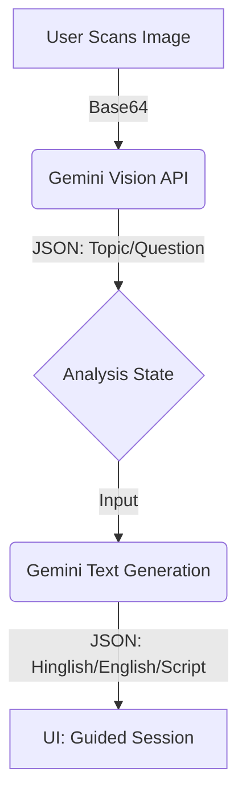

# 🚀 Project Handover: Parent-Co-Teacher

**Status:** Tier 1 (Bare Minimum) Complete  
**Tech Stack:** React (v19), Tailwind CSS, Google Gemini SDK (@google/genai)  
**Goal:** Empower parents with limited literacy to help their children with homework.

---

## 1. What is currently built (Tier 1 Status)

We have successfully implemented the "Happy Path" for the core user loop.

### ✅ Features Implemented
1.  **Multi-Kid Dashboard:**
    *   Users can switch between "Riya" (Class 4) and "Aarav" (Class 8).
    *   Context (Subject/Grade) updates automatically.
2.  **Vision Pipeline:**
    *   Large "Scan Homework" button (mobile-optimized).
    *   Accepts image input (camera/upload).
    *   **AI Step 1:** Sends image to `gemini-2.5-flash` to extract Subject, Chapter, and Question.
    *   *Fallback:* If no question is found, it extracts the "Concept".
3.  **Guided Parent Session:**
    *   **AI Step 2:** Generates a structured teaching guide based on the vision analysis.
    *   **Bilingual Support:** Generates explanations in **Hinglish** (Hindi in English script) and **English**.
    *   **Speak Script:** Provides a specific sentence for the parent to say to the child.
    *   **Verified Answer:** Provides the final solution.
4.  **Stability Mode:**
    *   Includes a robust Mock Data fallback in `constants.ts` if the API fails or for fast demos.

---

## 2. Codebase Overview

The project uses a flat file structure for the hackathon (no deep nested `src` folders).

### 📂 Key Files
*   **`App.tsx`**: The main state machine. Manages `idle` -> `analyzing` -> `generating` -> `active` states.
*   **`services/geminiService.ts`**: The brain of the app.
    *   `analyzeHomeworkImage`: OCR & Topic detection.
    *   `generateParentGuide`: Generates the Hinglish/English teaching content.
*   **`types.ts`**: Shared TypeScript interfaces. Crucial for understanding the data flow (`HomeworkAnalysis`, `GuidedSession`).
*   **`constants.ts`**: Contains `KIDS` profiles and `MOCK_` data. **Use this to change the demo characters.**

---

## 3. Architecture & Data Flow

### ⚠️ Important Implementation Details
1.  **API Key:** Injected automatically via `process.env.API_KEY`. Do not hardcode.
2.  **Mocking:** `geminiService.ts` has `try/catch` blocks. If the API errors out, it silently falls back to `MOCK_ANALYSIS` and `MOCK_SESSION` to prevent the demo from crashing.
3.  **State:** All state is local to `App.tsx`. No Redux/Context API is needed yet.

---

## 4. Next Steps (Your Job - Tier 2 Implementation)

You are tasked with implementing the **Tier 2 High-Impact Add-ons**.

### 🎯 Priority 1: Audio-First Experience (TTS)
*   **Goal:** Allow parents to listen to the "Parent Context" and "Speak Script".
*   **Implementation:** Use the browser's native `window.speechSynthesis` API for simplicity (or Gemini TTS if quality is required, but native is faster for hackathons).
*   **UI:** Add a "Play" speaker icon next to the text blocks in `App.tsx`.

### 🎯 Priority 2: Visual Cues (Tier 2)
*   **Goal:** Generate a simple image to explain the concept to the *child*.
*   **Current State:** The AI already generates a `visualCuePrompt` string in the `GuidedSession` object.
*   **Implementation:**
    1.  Create a new service function in `geminiService.ts` to call `gemini-2.5-flash-image` (or `imagen`).
    2.  Pass the `guide.visualCuePrompt` to it.
    3.  Display the result in a new card in `App.tsx` labeled "Show this to Riya".

### 🎯 Priority 3: Weakness Tracking
*   **Goal:** Show a summary of what the child struggled with.
*   **Implementation:**
    1.  Add a simple "Thumbs Up / Thumbs Down" interaction after the session.
    2.  Store a counter in local state (or a simple map).
    3.  Display a "Learning Radar" summary if time permits.

---

## 5. Developer Cheat Sheet

*   **To change the "Mock" response:** Edit `constants.ts`.
*   **To tweak the AI personality:** Edit the system prompt in `services/geminiService.ts`.
*   **If Vision fails:** The app defaults to "Concept Explanation" mode automatically.

Good luck! 🚀
